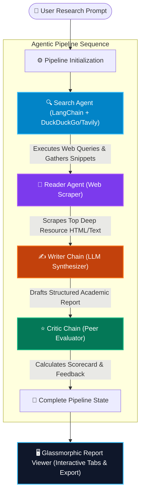

# ResearchMind 🔬  
### *Autonomous Multi-Agent AI Research Network & Intelligence Pipeline*

[](https://multi-agent-research-system-khaki.vercel.app)
[](https://www.python.org/)
[](https://fastapi.tiangolo.com/)
[](https://react.dev/)
[](https://groq.com/)
[](LICENSE)

**ResearchMind** is a state-of-the-art multi-agent AI research network designed to automate deep academic, market, and technical research. Operating as a sequential agentic pipeline powered by LangChain, FastAPI, and React, ResearchMind deploys specialized AI agents to gather web intelligence, scrape full-body articles, synthesize comprehensive reports, and perform objective peer-review evaluations.

🌐 **Live Public Demo:** [https://multi-agent-research-system-khaki.vercel.app](https://multi-agent-research-system-khaki.vercel.app)

---

## 🌟 Key Features

* **🤖 Autonomous Multi-Agent Network:** Deploys a team of 4 specialized LangChain agents operating in tandem (Search Agent, Reader Agent, Writer Chain, and Critic Reviewer).
* **⚡ Ultra-Fast Groq & Llama 3.3 Integration:** Leverages Groq's LPU acceleration with `llama-3.3-70b-versatile` for blazing fast, high-reasoning intelligence synthesis.
* **🔍 Keyless Free Web Search:** Integrates **DuckDuckGo Search** (`ddgs`) alongside Tavily, enabling keyless research execution out-of-the-box.
* **🎨 Next-Gen Obsidian Glassmorphic UI:** Built with React 19, featuring ambient neon mesh glow halos, real-time node state indicators, and responsive tab views.
* **📡 Real-Time SSE Event Streaming:** Streams step-by-step progress, raw web sources, scraped contents, and intermediate logs live over Server-Sent Events (SSE).
* **⭐ Objective Critic Scorecard:** Every report undergoes peer-review evaluation by the Critic Chain, yielding an overall score (e.g. `9.2/10`), strengths breakdown, and areas for improvement.
* **🔒 Enterprise Security & Dual-Key System:** Zero hardcoded API keys in tracked code. Supports pre-configured server environment variables (`GROQ_API_KEY`) with client-side local storage fallback.
* **📥 One-Click Export:** Instantly copy formatted markdown or download `.md` research report files.

---

## 🧠 System Architecture & Agent Flow

The ResearchMind pipeline follows a deterministic multi-stage orchestration workflow:



---

## 🛠️ Supported LLM & Search Providers

| Provider | Supported Models | Pricing Tier | Key Required? |
| :--- | :--- | :--- | :--- |
| **Groq (Default)** | `llama-3.3-70b-versatile`, `llama-3.1-8b-instant` | ⚡ Ultra-Fast / Free | Optional (Server Key pre-configured) |
| **Google Gemini** | `gemini-flash-latest`, `gemini-1.5-pro` | 🟢 Free Tier Available | Yes (Google AI Studio) |
| **OpenAI** | `gpt-4o-mini`, `gpt-4o` | 💳 Paid API | Yes (OpenAI Platform) |
| **Ollama** | `llama3`, `mistral`, `phi3` | 💻 100% Local & Free | No (Localhost URL) |
| **DuckDuckGo (Search)** | N/A | 🌐 Free Web Search | **No Key Needed** |
| **Tavily (Search)** | N/A | 🔍 Free Tier Available | Yes (Tavily AI) |

---

## 🚀 Quickstart & Local Development

### 1. Prerequisites
Ensure you have **Python 3.10+** and **Node.js 18+** installed on your system.

### 2. Clone Repository & Setup Virtual Environment
```bash
git clone https://github.com/AdeenaRamzan/Multi-agent-research-system.git
cd Multi-agent-research-system

# Create Python virtual environment
python -m venv venv
# On Windows:
venv\Scripts\activate
# On macOS/Linux:
source venv/bin/activate
```

### 3. Install Python Dependencies
```bash
pip install -r requirements.txt
```

### 4. Build Frontend Static Assets
```bash
cd frontend
npm install
npm run build
cd ..
```

### 5. Configure Environment Variables (Optional)
Create a `.env` file in the root directory:
```env
GROQ_API_KEY=gsk_your_groq_api_key_here
```

### 6. Run the Application
Start the unified FastAPI application server:
```bash
python app.py
```
Open your browser and navigate to **`http://localhost:8001`** (or `http://localhost:8000`).

---

## ☁️ Deployment

### Vercel (Recommended & 24/7 Free)
ResearchMind is pre-configured for 1-click deployment on Vercel (`vercel.json` included):

1. Fork or push this repository to your GitHub account.
2. Go to [vercel.com/new](https://vercel.com/new) and import your repository.
3. Add the Environment Variable under settings:
   * **Key:** `GROQ_API_KEY`
   * **Value:** `gsk_your_groq_api_key`
4. Click **Deploy**. Vercel will serve the application instantly!

---

## 🔒 Security & Privacy

* **Zero Hardcoded Secrets:** No private keys are committed in tracked repository code (`.env` listed in `.gitignore`).
* **Local Storage Protection:** Client-entered API keys are stored exclusively in the browser's `localStorage` and transmitted via encrypted POST payload for the duration of the pipeline execution.

---

## 📄 License

Distributed under the **MIT License**. See `LICENSE` for more information.

Developed with ❤️ by **Adeena Ramzan** as an open-source Multi-Agent AI System.
