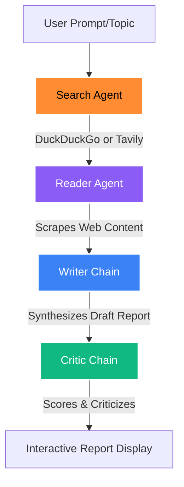

# ResearchMind 🔬
### AI Multi-Agent Research Network & Pipeline

ResearchMind is a premium, multi-agent AI system that automates deep academic and web research. It deploys a network of specialized LangChain agents to search, scrape, write, and critique a structured report on any topic of your choice.

The system features a stunning, glassmorphic dark-themed React single-page application (SPA) backed by a FastAPI web server, offering real-time status and log streaming (via Server-Sent Events).

---

## 🚀 Key Features

*   **Premium Glassmorphic UI:** Modern dashboard with layout transitions, progress pipelines, live terminal logs, and custom tab views.
*   **Multi-Provider LLM Integration:** Choose between **OpenAI** (GPT models), **Google Gemini** (featuring a robust free tier), or **Ollama** (completely local and free).
*   **Keyless/Free Alternative Mode:** Use the system entirely for free! Skip Tavily and use **DuckDuckGo Search** (no key required) alongside local Ollama or free Gemini keys.
*   **Dynamic API Key Inputs:** Enter your API keys directly in the frontend during execution. Keys are kept safe: stored only in your browser's local storage and never persisted on the server.
*   **SSE Real-Time Log Streaming:** Watch intermediate outputs from the Search Agent, Scraping Reader, Writer, and Critic stream live in a terminal panel.
*   **Constructive Critic Reviews:** Get an objective feedback breakdown (Score out of 10, Strengths, Areas to Improve) alongside the final markdown report.
*   **One-Click Copy & Download:** Instantly copy formatted markdown or download a `.md` research report file.

---

## 🛠️ Architecture

The system uses a sequential agentic pipeline:



1.  **Search Agent:** Evaluates the topic, drafts optimal query arguments, and executes web search (Tavily or DuckDuckGo).
2.  **Reader Agent:** Examines search records, selects the single most promising resource, scrapes it, and parses clean text content.
3.  **Writer Chain:** Synthesizes the search logs and scraped content into a professional, structured markdown document.
4.  **Critic Chain:** Reviews the draft report and issues a scorecard and verdict.

---

## 💻 How to Run Locally

### 1. Prerequisites
Ensure you have Python 3.10+ and Node.js v18+ installed on your computer.

### 2. Setup Dependencies
Install the required Python libraries:
```bash
python -m pip install -r requirements.txt
```

### 3. Build the Frontend
Vite compiles React into static assets served directly by FastAPI. Build them with:
```bash
cd frontend
npm install
npm run build
cd ..
```

### 4. Run the Application
Start the FastAPI server:
```bash
python app.py
```
Open your browser and navigate to **[http://localhost:8000](http://localhost:8000)** to start researching!

---

## 🛠️ Local Development (Hot-Reloading)

If you are modifying the codebase, run the backend and frontend separately to enjoy instant page refresh (hot-reloading):

1.  **Start FastAPI Backend:**
    ```bash
    python app.py
    ```
    *(Runs on `http://localhost:8000`)*
2.  **Start Vite React Dev Server:**
    ```bash
    cd frontend
    npm run dev
    ```
    *(Runs on `http://localhost:5173`. Any API request will automatically proxy to the backend on port 8000).*

---

## ☁️ How to Deploy

Because the compiled React frontend is served as static files directly from the Python backend, deployment is simple and can be hosted on a single container or service.

### Option A: PaaS (Render, Railway, Heroku)
You can deploy directly from your GitHub repository using the following settings:
*   **Build Command:** `pip install -r requirements.txt && cd frontend && npm install && npm run build`
*   **Start Command:** `python app.py` (FastAPI automatically respects the `$PORT` environment variable set by the hosting provider).

### Option B: Docker Container
To deploy as a containerized app on AWS, GCP, Azure, or Fly.io, you can create a simple `Dockerfile` in the root:

```dockerfile
# 1. Build frontend React static assets
FROM node:22-alpine AS frontend-builder
WORKDIR /app/frontend
COPY frontend/package*.json ./
RUN npm install
COPY frontend/ ./
RUN npm run build

# 2. Package FastAPI application
FROM python:3.11-slim
WORKDIR /app
COPY requirements.txt .
RUN pip install --no-cache-dir -r requirements.txt
COPY . .
# Copy compiled frontend from step 1
COPY --from=frontend-builder /app/frontend/dist /app/frontend/dist

EXPOSE 8000
ENV PORT=8000
CMD ["python", "app.py"]
```

Build and run your docker container:
```bash
docker build -t researchmind .
docker run -p 8000:8000 -e PORT=8000 researchmind
```
